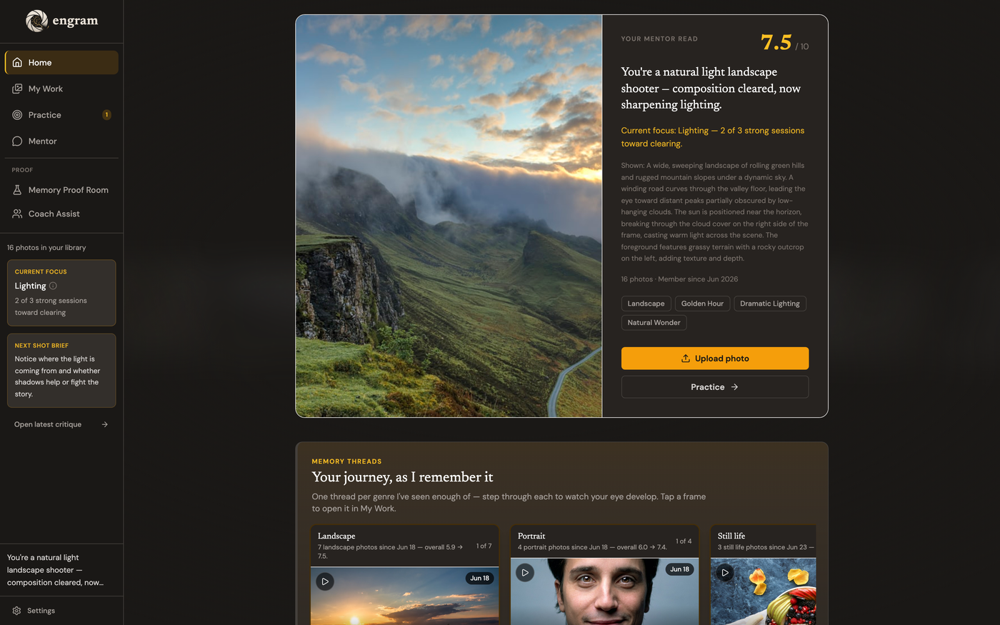
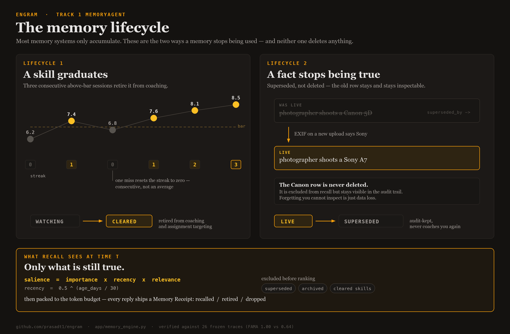
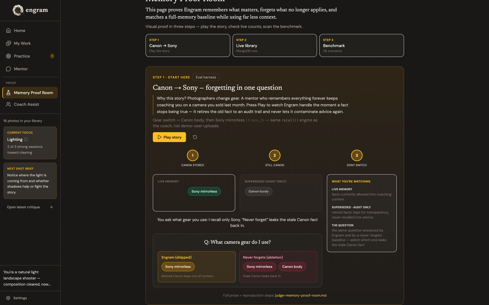
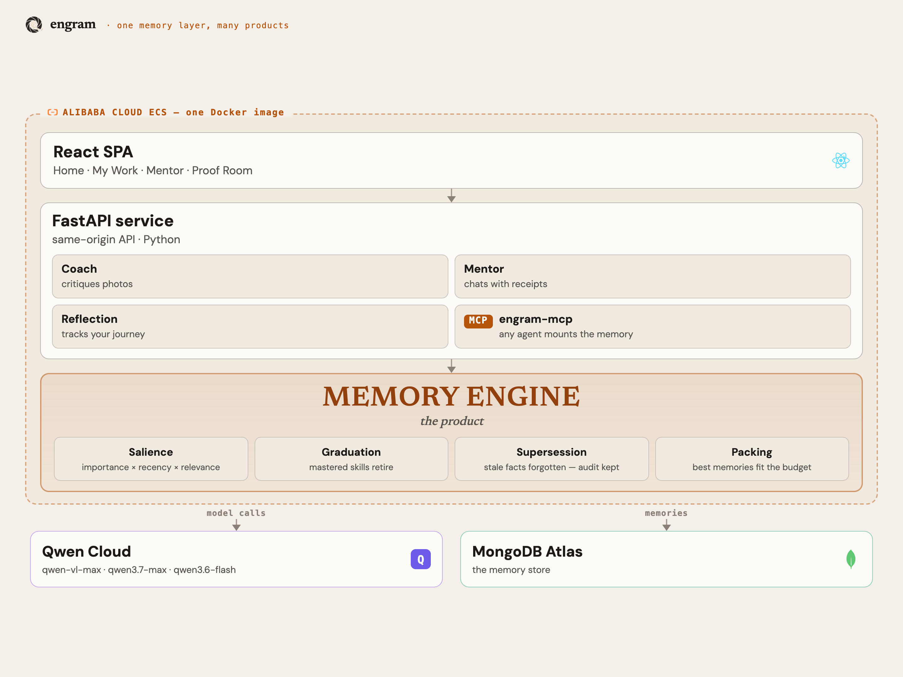

# Engram — Memory that coaches

**An AI photography coach that remembers your journey, forgets what you've mastered, and always knows your next step.**

Built on **Qwen Cloud** + **Alibaba Cloud ECS** for the [Global AI Hackathon with Qwen Cloud](https://qwen-global-hackathon.devpost.com/) — **Track 1: MemoryAgent**.

---

**Why it matters.** Every AI photo tool today is an amnesiac critic. Lightroom edits, AfterShoot culls, and multimodal chat will happily grade one frame — then forget you exist. You re-explain yourself every session. Nothing knows whether you're improving.

**What I built.** Engram is a photography coach with a real memory engine: salience-scored recall, skill graduation (forgetting as promotion), supersession with an audit trail, token-budget packing with Memory Receipts, and a custom MCP server any Qwen agent can mount. The product surfaces that memory as behavior — Home, Practice, Mentor, Proof Room — not as a metrics dashboard.

**The differentiator.** Most memory systems only accumulate. Engram also forgets on purpose — and can prove it. Measured on 26 frozen traces: **FAMA 1.00** vs **0.64** for both a recency-only baseline and a never-forgets ablation, at **1.72× fewer** context tokens, with recall of still-true facts unchanged at 100%.

---

> ### Track 1 · MemoryAgent — fastest paths in
>
> **For judges, reviewers, and fellow builders:**
>
> | Path | Link | Time |
> | --- | --- | --- |
> | **Watch the demo** | [youtu.be/mGoP-pDrKw0](https://youtu.be/mGoP-pDrKw0) | ~3 min |
> | **Try the live app** | [engram.prasadtilloo.com/?judge=1](https://engram.prasadtilloo.com/?judge=1) | 60 s |
> | **Reproduce the benchmark** | `python -m eval.run --compare` · [`eval/README.md`](eval/README.md) | ~1 min |
> | **Alibaba / Qwen proof** | [`docs/ALIBABA_CLOUD_PROOF.md`](docs/ALIBABA_CLOUD_PROOF.md) | 2 min |
>
> **TL;DR:** Forgetting-aware memory for a photography coach — graduation, supersession, receipts, `engram-mcp`, FAMA — running live on Alibaba ECS with every model call through Qwen Cloud.

[](https://www.alibabacloud.com/help/en/model-studio/)
[](https://www.alibabacloud.com/product/ecs)
[](app/engram_mcp.py)
[](https://www.python.org/)
[](https://fastapi.tiangolo.com/)
[](https://react.dev/)
[](https://www.mongodb.com/atlas)
[](LICENSE)

---

## Contents

- [Track 1 quickstart](#track-1--memoryagent--fastest-paths-in)
- [Live evidence](#live-evidence)
- [Benchmark results](#benchmark-results)
- [What it does](#what-it-does)
- [Why this is a MemoryAgent](#why-this-is-a-memoryagent)
- [Architecture](#architecture)
- [Try it yourself](#try-it-yourself)
- [Quick start (local)](#quick-start-local)
- [Testing](#testing)
- [Built on Iris](#built-on-iris)
- [Documentation](#documentation)
- [License](#license)

---

## Live evidence

| Endpoint | Status | URL |
| --- | --- | --- |
| Production app (HTTPS) | Live | [engram.prasadtilloo.com](https://engram.prasadtilloo.com/) |
| Judge mode (seeded demo) | Live | [/?judge=1](https://engram.prasadtilloo.com/?judge=1) |
| Demo video | Public | [youtu.be/mGoP-pDrKw0](https://youtu.be/mGoP-pDrKw0) |
| Source | Public · Apache-2.0 | [github.com/prasadt1/engram](https://github.com/prasadt1/engram) |
| MCP health (live round-trip) | Live | [`/api/v1/memory-stats?via=mcp`](https://engram.prasadtilloo.com/api/v1/memory-stats?via=mcp) → `"served_via": "engram-mcp"` |
| Alibaba deployment proof | Documented | [`docs/ALIBABA_CLOUD_PROOF.md`](docs/ALIBABA_CLOUD_PROOF.md) |

### Engineering snapshot

| Metric | Value |
| --- | --- |
| Pytest suite | **219** tests (no live network in CI path) |
| Architecture Decision Records | **8** ([`docs/architecture/`](docs/architecture/)) |
| Frozen FAMA traces | **26** ([`eval/`](eval/README.md)) |
| Qwen models in production | `qwen-vl-max` · `qwen3.7-max` · `qwen3.6-flash` |
| Deploy | One Docker image on **Alibaba Cloud ECS** (Singapore) · Caddy TLS · same-origin SPA |

---

## Benchmark results

| config | mean FAMA | recall of still-true facts | context tokens |
| --- | --- | --- | --- |
| **Engram (forgetting on)** | **1.00** | 100% | **1.72× fewer** |
| recency-only (keep the 5 newest facts) | 0.64 | 100% | baseline |
| never-forgets (full history) | 0.64 | 100% | baseline |

**FAMA gap (default − either baseline): 0.36.** On this freeze every trace has ≤5 facts, so the two baselines tie — recency cannot tell that a newer fact **invalidates** an older one. Both baselines leak a retired fact into **18 of 26** answers; supersession-aware forgetting is the only config that fixes it.

> **Q: "What camera gear do I use?"** (Canon → Sony in session 3)
>
> - **Recency-only / full-history:** mentions *both* Canon and Sony
> - **Engram:** Sony only — the Canon fact is superseded and excluded from recall (kept for audit)

Reproduce: `python -m eval.run --compare`. Methodology and λ / token-estimate disclosures: [`eval/README.md`](eval/README.md).



---

## What it does

Engram runs one loop:

1. **Critique** — upload a photo; `qwen-vl-max` scores five dimensions with glass-box reasoning and grounded photography principles (~30s). A local salvage layer (`app/output_salvage.py`) repairs known JSON drift in ~0.1ms instead of re-calling the model.
2. **Remember** — every critique writes salience-scored memory, skill evidence, and genre identity. The UI narrates *what it learned from this photo*.
3. **Focus** — watched skills graduate after three consecutive above-bar sessions: celebrated on the timeline, retired from active coaching and assignment targeting. Forgetting as promotion, not deletion.
4. **Adapt** — Mentor chat and the next critique are built from what's still true. Superseded facts stay audit-visible via `superseded_by`.

### Product surfaces

| Surface | What you get |
| --- | --- |
| **Home** | Mentor-read hero, **genre memory threads** (score-growth captions), current focus + next-shot brief |
| **Work** | Portfolio of critiques with EXIF metadata (make/model, exposure; GPS privacy-gated) |
| **Practice** | Memory-driven assignments — the coach picks the watched skill closest to clearing and says why |
| **Mentor** | SSE-streamed chat with a **Memory Receipt** on every reply (recalled / retired / dropped for budget) |
| **Proof Room** | Canon→Sony animated supersession story, live MongoDB counts, FAMA heatmap; MCP toggle round-trips `engram-mcp` |
| **Coach Assist** (`?judge=1`) | Same engine, three learners side by side (Jordan / Alex / Sam) — per-user isolation for schools & workshops |
| **engram-mcp** | MCP tools: `recall` · `forget` · `get_memory_stats` — any Qwen agent can mount the engine |



---

## Why this is a MemoryAgent

| Track 1 requirement | How Engram does it |
| --- | --- |
| **Efficient retrieval** | [`app/memory_engine.py`](app/memory_engine.py) — `recall_scored()` ranks by `importance × recency × query-relevance` with a per-item score breakdown |
| **Timely forgetting** | Skill graduation (WATCHING → CLEARED) + `supersede()` — retired items excluded from recall by default, preserved for audit |
| **Recall within limited context** | [`app/context_builder.py`](app/context_builder.py) — packs highest-salience live items under a token budget; `.receipt()` powers the in-product Memory Receipt |
| **Qwen + custom agent tooling** | 3-tier routing in [`app/config.py`](app/config.py); custom MCP in [`app/engram_mcp.py`](app/engram_mcp.py); live `?via=mcp` path in [`app/server.py`](app/server.py); frozen [`eval/`](eval/README.md) |

---

## Architecture



*One Docker image on Alibaba Cloud ECS: Coach, Mentor, Reflection, and `engram-mcp` around the memory engine. Every model call goes to Qwen Cloud; every memory lives in MongoDB Atlas.*

**Full data-flow (vector, zoom freely):** [`docs/architecture/system-flow.svg`](https://raw.githubusercontent.com/prasadt1/engram/main/docs/architecture/system-flow.svg?v=3)

```
Browser (React)
   │  REST (camelCase JSON) · same-origin
   ▼
FastAPI (app/server.py)  ── Caddy TLS ── Alibaba ECS
   │
   ├─ Coach ──────► grounding + salvage ─► qwen-vl-max
   ├─ Mentor ─────► context_builder ─────► qwen3.6-flash (SSE)
   ├─ Reflection ─► context_builder ─────► qwen3.6-flash
   │
   ├─ memory_engine (salience · graduation · supersession · packing)
   │     └─ memory_store ─► MongoDB Atlas
   │
   └─ engram-mcp (stdio) · /api/v1/memory-stats?via=mcp

Photos: ECS local /media (OSS signed-URL backend one env flip away)
```

**ADRs** (alternatives I didn't take and why): [`docs/architecture/`](docs/architecture/README.md)

---

## Try it yourself

| **Judge / demo** | **Local clone** |
| --- | --- |
| Open [/?judge=1](https://engram.prasadtilloo.com/?judge=1) — no login | See [Quick start](#quick-start-local) |
| Seeded photographer with real critiques | Needs DashScope + MongoDB |
| Sidebar → **Proof** → Memory Proof Room · **Coach Assist** | `python scripts/seed_demo_user.py` (~20 min, live VL calls) |

**60-second walkthrough**

1. **Home** — mentor-read hero, step through a memory thread  
2. **Click a thread photo** — scores, “what I learned,” chat scoped to that frame  
3. **Proof Room** — Play Canon→Sony, flip the MCP toggle, scan FAMA  
4. **Coach Assist** (judge mode) — three parallel learner arcs  
5. Optional: upload a photo — real `qwen-vl-max` critique in ~30s (shared demo library)

---

## Quick start (local)

**1. Clone and configure**

```bash
git clone https://github.com/prasadt1/engram.git
cd engram
cp .env.example .env
```

| variable | purpose |
| --- | --- |
| `DASHSCOPE_API_KEY` | Qwen Cloud / DashScope API key |
| `QWEN_BASE_URL` | DashScope-compatible endpoint (intl PAYG default) |
| `MONGODB_URI` | MongoDB connection string |
| `MONGODB_DB_NAME` | defaults to `engram` |
| `STORAGE_BACKEND` | `local` (default) or `oss` |
| `OSS_*` | Alibaba OSS credentials when `STORAGE_BACKEND=oss` |

**2. Backend**

```bash
# Docker (port 8080)
docker compose up

# or dev (port 8000)
python -m venv .venv && source .venv/bin/activate
pip install -r requirements.txt
uvicorn app.server:app --reload --port 8000
```

**3. Frontend**

```bash
cd frontend && npm install && npm run dev
```

**4. Seed judge journey**

```bash
python scripts/seed_demo_user.py
# optional multi-learner roster:
# python scripts/seed_coach_assist_learners.py
```

Open `http://localhost:5173/?judge=1`.

---

## Testing

```bash
python -m pytest
```

**219** tests — memory engine, salvage, MCP, coach/mentor, assignments, Coach Assist, EXIF, server routes. No live network calls in the default suite.

Benchmark (needs API key for live model answers only if you extend beyond frozen traces):

```bash
python -m eval.run --compare
```

---

## Built on Iris

Engram is a **new** product built during the Global AI Hackathon with Qwen Cloud submission period, on my own open-source foundation: [Iris Photography Mentor](https://github.com/prasadt1/iris-photography-mentor) (Apache-2.0).

**Reused from Iris (disclosed):** MongoDB schemas / Pydantic models, portfolio utilities, photography-principles corpus, base React components.

**New in Engram:** forgetting-aware memory engine, `engram-mcp`, FAMA `/eval`, full Qwen Cloud port, Alibaba ECS deployment, memory-first UI (threads, receipts, Proof Room, Practice, Coach Assist).

---

## Documentation

| Doc | What |
| --- | --- |
| [`docs/DEVPOST-DRAFT.md`](docs/DEVPOST-DRAFT.md) | Devpost submission draft |
| [`docs/ALIBABA_CLOUD_PROOF.md`](docs/ALIBABA_CLOUD_PROOF.md) | ECS + DashScope evidence |
| [`docs/judge-memory-proof-room.md`](docs/judge-memory-proof-room.md) | Proof Room methodology |
| [`docs/architecture/`](docs/architecture/) | ADRs + system-flow SVG |
| [`eval/README.md`](eval/README.md) | FAMA methodology |
| [`docs/mcp-transcript.md`](docs/mcp-transcript.md) | Live MCP protocol transcript |

---

## License

Apache-2.0 — see [`LICENSE`](LICENSE).

Built for the Global AI Hackathon with Qwen Cloud · Track 1: MemoryAgent.
