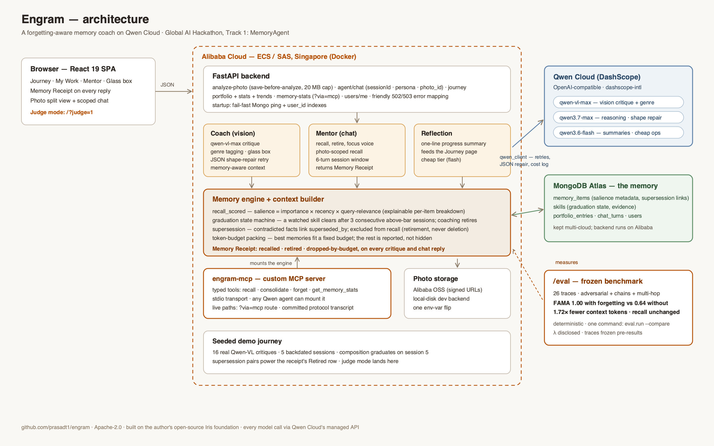

# Engram

**An AI photography coach that remembers your journey, forgets what you've mastered, and always knows your next step.**

Built on Qwen Cloud for the Global AI Hackathon (Track 1: MemoryAgent).

---

## Results

| config | mean FAMA | mean token-savings ratio |
|---|---|---|
| default (engine) | **1.0** | **1.72x** |
| recency-only (naive baseline) | 0.6385 | 1.0x |
| no-forgetting (ablation) | 0.6385 | 1.0x |

**FAMA gap (default − either baseline): 0.3615.** Three configs: the engine, a naive top-k-by-recency baseline (same `k=5` budget, no forgetting awareness), and a full-history no-forgetting ablation. On this freeze every trace has ≤5 facts, so the two baselines tie. Recall accuracy (MPA) is identical across configs — every trace hits 100% of `expects_current` — so the engine isn't trading recall for forgetting; it gets both, at ~1.72x lower token cost than either baseline. 26 frozen traces, seed=0, no wall clock in scoring.

> **Q: "What camera gear do I use?"**
> — **Recency-only / full-history:** mentions *both* "shoots primarily with a Canon body" *and* "switched to a Sony mirrorless body"
> — **Engram (default):** "switched to a Sony mirrorless body" — **Sony only**
>
> The Canon fact was superseded in session 3. The default engine excludes anything with a live `superseded_by` link; both baselines surface the retired Canon fact.

Reproduce: `python -m eval.run --compare`. Full methodology, per-trace tables, and the λ/token-estimate disclosures: [`eval/README.md`](eval/README.md).

---

## What it does

- **Glass-box photo critique** — every upload gets scored across five dimensions (composition, lighting, technique, creativity, subject impact) by `qwen-vl-max`, with inspectable reasoning steps and grounding citations, not a black-box number.
- **Memory-aware coaching** — the Mentor chat and every critique recall the photographer's own history (salience-scored, forgetting-aware) instead of treating each session as a cold start.
- **Graduation, not just tracking** — a watched weakness (e.g. composition) "clears" after 3 consecutive above-bar sessions and stops being surfaced; Engram knows what you've already fixed.
- **A Memory Receipt on every reply** — what was recalled, what was excluded because it's retired, and what got dropped for token budget. Retrieval is explainable in the product, not just in a judge appendix.
- **`engram-mcp`** — the memory engine exposed as a standard MCP server (`recall` / `forget` / `get_memory_stats`) any Qwen agent can mount, not a proprietary API only this app can call.
- **Judge mode** — `/?judge=1` drops a judge straight into a fully-seeded demo journey with zero setup.

---

## Why this is a MemoryAgent

| Track 1 requirement | how Engram does it |
|---|---|
| **Efficient retrieval** | [`app/memory_engine.py`](app/memory_engine.py) — `recall_scored()` ranks by `importance × recency × query-relevance`, and returns a per-item score breakdown (not just a ranked list) so retrieval is explainable, not opaque. |
| **Timely forgetting** | [`app/memory_engine.py`](app/memory_engine.py) — a `Skill` graduation state machine retires a coached weakness after 3 consecutive above-bar sessions, and `supersede()` retires any memory item in favor of a newer one. Forgotten items are excluded from `recall()` by default — retirement, not erasure, but retirement that actually changes what's recalled. |
| **Recall within limited context** | [`app/context_builder.py`](app/context_builder.py) — `build_memory_context()` greedily packs the highest-salience live items under a token budget and returns a `MemoryContext` whose `.receipt()` is the Memory Receipt shown in the product. |
| **Qwen API sophistication** | [`app/config.py`](app/config.py) — 3-tier model routing (`qwen-vl-max` for vision, `qwen3.7-max` for reasoning, `qwen3.6-flash` for fast paths, each with a documented fallback model). [`app/engram_mcp.py`](app/engram_mcp.py) + [`docs/mcp-transcript.md`](docs/mcp-transcript.md) — a custom MCP server with a live, real-subprocess protocol transcript, and a production `?via=mcp` path ([`app/server.py`](app/server.py)) that round-trips a real request through the MCP stdio server instead of just calling the store in-process. [`eval/`](eval/README.md) — a reproducible, frozen-trace-set benchmark, not a cherry-picked demo. |

---

## Architecture


*(Browser → FastAPI → specialist pipelines → Qwen Cloud, with MongoDB-backed memory and an MCP server mounted alongside the API.)*

```
Browser (React)
   │  REST (camelCase JSON)
   ▼
FastAPI app (app/server.py)
   │
   ├─ Coach ───────► grounding (principles corpus) ─► qwen_client ─► qwen-vl-max
   ├─ Mentor ──────► context_builder (recall + pack) ─► qwen_client ─► qwen3.6-flash (SSE stream)
   ├─ Reflection ──► context_builder ─► qwen_client ─► qwen3.6-flash
   │
   ├─ memory_engine (pure Python: salience recall, graduation, packing)
   │     └─ memory_store (MongoDB-backed wrapper) ─► MongoDB
   │
   └─ engram-mcp (stdio MCP server, app/engram_mcp.py)
         mounted by scripts/run_mcp_server.py; /api/v1/memory-stats?via=mcp
         round-trips a real request through it as a live protocol health check

Photo storage: local disk (dev) or Alibaba OSS with signed URLs (prod), via app/storage.py
```

**Why it's built this way:** [`docs/architecture/`](docs/architecture/README.md) has the Architecture Decision Records behind the non-obvious calls — porting Iris instead of rebuilding, keeping MongoDB Atlas, shipping a real MCP server instead of a REST-only API, deploying on Alibaba PAYG around a stuck verification queue, serving the SPA same-origin, moving mentor chat off the reasoning tier after a live 78s-latency finding, HTTPS via Caddy, and streaming chat over SSE.

---

## Quickstart

**1. Clone and configure**

```bash
git clone <this-repo>
cd engram
cp .env.example .env
```

Fill in `.env` (values are placeholders in `.env.example`, never commit real ones):

| variable | purpose |
|---|---|
| `DASHSCOPE_API_KEY` | Qwen Cloud / DashScope API key |
| `QWEN_BASE_URL` | DashScope-compatible endpoint (defaults to the pay-as-you-go intl endpoint) |
| `MONGODB_URI` | MongoDB connection string |
| `MONGODB_DB_NAME` | defaults to `engram` |
| `OSS_ACCESS_KEY_ID`, `OSS_ACCESS_KEY_SECRET`, `OSS_BUCKET`, `OSS_ENDPOINT` | Alibaba OSS photo storage (optional — local disk storage is the default) |

**2. Run the backend — Docker or dev mode**

Docker (backend on `:8080`):

```bash
docker compose up
```

Dev mode (backend on `:8000`):

```bash
python -m venv .venv && source .venv/bin/activate
pip install -r requirements.txt
uvicorn app.server:app --reload --port 8000
```

Frontend (`:5173`):

```bash
cd frontend
npm install
npm run dev
```

**3. Seed the demo journey**

```bash
python scripts/seed_demo_user.py
```

Takes ~20 minutes and makes ~16 real Qwen vision calls — it builds a scripted five-session photography journey for `demo-user` where composition graduates and lighting sits one session from clearing, so the graduation/forgetting story is visible on first look rather than requiring weeks of real use.

**4. Judge mode**

Open **`/?judge=1`**. It scopes the app straight to the seeded `demo-user` journey, skips onboarding, and lands on Home — graduation cards, current-focus streaks, and the Memory Receipt under every reply are all live from the seeded data. Sidebar **Proof → Memory Proof Room** (`#glassbox`) is a visual three-step walkthrough (Canon/Sony animation, live MongoDB counts, benchmark heatmap). Full text: [`docs/judge-memory-proof-room.md`](docs/judge-memory-proof-room.md).

**5. Tests**

```bash
python -m pytest
```

219 tests, no live network calls.

---

## Built on Iris

Engram is a new product built during the Global AI Hackathon with Qwen Cloud submission period (May 26 – Jul 9, 2026), on my own open-source foundation: [Iris Photography Mentor](https://github.com/prasadt1/iris-photography-mentor) (Apache-2.0), a Gemini/Google-ADK photography mentor I built earlier this year.

Reused from Iris (my own Apache-2.0 code, disclosed): MongoDB schemas and Pydantic models, portfolio/trend utilities, the photography-principles grounding corpus, and base React components. Everything that defines Engram as a MemoryAgent — the forgetting-aware memory engine, `engram-mcp`, the full Qwen Cloud port, the `/eval` benchmark, the Alibaba Cloud deployment, and the rebuilt memory-first UI — is new work from the submission period.

---

## License

Apache-2.0 — see [`LICENSE`](LICENSE).

Built for the Global AI Hackathon with Qwen Cloud, Track 1: MemoryAgent.
