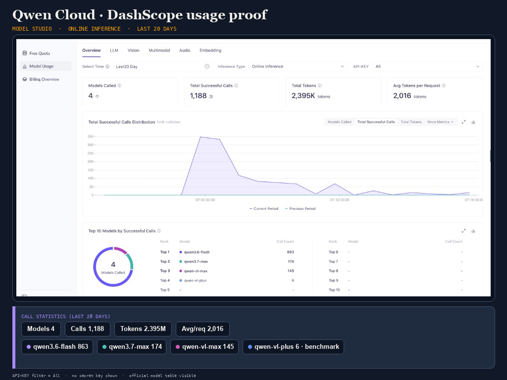

# Proof of Alibaba Cloud deployment

This document collects the evidence that Engram's backend runs on Alibaba Cloud, per the hackathon submission requirements.

## 1. Code files using Alibaba Cloud services and APIs

- **Alibaba OSS (object storage)** — [`app/storage.py`](../app/storage.py): the `OSSStorage` class uses the official `oss2` SDK against a private bucket in `ap-southeast-1`, with presigned read URLs (`sign_url`). Selected via `STORAGE_BACKEND=oss`. *(Production currently serves photos from ECS local volume / media; OSS remains one env flip away.)*
- **Qwen Cloud / DashScope (managed model API)** — [`app/qwen_client.py`](../app/qwen_client.py): every model call in the product goes through Alibaba's OpenAI-compatible endpoint at `dashscope-intl.aliyuncs.com` (`qwen-vl-max`, `qwen3.7-max`, `qwen3.6-flash`; IDs in [`app/config.py`](../app/config.py)). No self-hosted weights anywhere.

## 2. Containerized deployment

The backend ships as a Docker image ([`Dockerfile`](../Dockerfile), [`docker-compose.yml`](../docker-compose.yml)) verified end-to-end in-container, including the `engram-mcp` subprocess path (`GET /api/v1/memory-stats?via=mcp` returns `"served_via": "engram-mcp"` from inside the image).

## 3. Live instance (ECS, Singapore)

Deployed **July 4, 2026** on a pay-as-you-go ECS instance (still running as of the Jul 15 capture below).

| Field | Value |
|-------|--------|
| Instance ID | `i-t4nefbdogtkjqbvvyxsn` |
| Name | `launch-advisor-20260704` |
| Region / zone | **ap-southeast-1 · Singapore A** |
| Type | `ecs.e-c1m1.large` · 2 vCPU / 2 GiB · Ubuntu 24.04 |
| Billing | Pay-as-you-go |
| Public IP | **`8.222.253.211`** |
| DNS | `engram.prasadtilloo.com` → `8.222.253.211` |
| Public endpoint | **https://engram.prasadtilloo.com** (Caddy TLS; SPA + API same-origin) |
| Judge mode | https://engram.prasadtilloo.com/?judge=1 |
| Health | https://engram.prasadtilloo.com/health → `{"status":"ok"}` |
| MCP path | https://engram.prasadtilloo.com/api/v1/memory-stats?via=mcp → `"served_via": "engram-mcp"` |
| Fallback (no DNS) | http://8.222.253.211:8080/?judge=1 |

**Host containers (SSH, Jul 15):** `engram-caddy-1` (ports 80/443) and `engram-engram-1` (uvicorn on 8080) both **Up**.

### Console + host evidence panel

Themed composite (Engram dark chrome): **full-bleed** ECS console + SSH `docker compose ps`, with Instance ID and Public IP called out in amber on the fact strip. Raw screenshots under [`proof-raw/`](proof-raw/).

## 4. Qwen Cloud / DashScope usage (Model Studio)

Every product model call is billed through DashScope. Captured **July 19, 2026** from **Model Studio → Usage and Billing → Model Usage → Overview** (filter: last 20 days · Online Inference · API-KEY = All):

| Metric (20 days) | Value |
|------------------|--------|
| Models called | **4** |
| Successful calls | **1,188** |
| Total tokens | **2.395M** |
| Shipped models | `qwen3.6-flash` (863) · `qwen3.7-max` (174) · `qwen-vl-max` (145) |
| Build-period benchmark | `qwen-vl-plus` (6) — tested as a faster repair option, rejected after 5/6 outputs were unparseable |

The official **Top 10 Models by Successful Calls** table is visible in the capture; the themed strip below repeats the same names and counts for readability.

**Where to re-check in the console:**

1. Open [Model Studio](https://modelstudio.console.alibabacloud.com/) (intl).
2. Left nav: **Usage and Billing → Model Usage** (this is call statistics — not Free Quota).
3. Tabs: Overview / LLM / Vision… · time range · **API-KEY** dropdown to filter one key.
4. API **keys themselves** (create/view/revoke): Model Studio → **API Key** / key management in the account menu or API References area — never paste a full `sk-…` into the repo or Devpost.

Raw Model Studio captures: [`proof-raw/qwen-model-usage.png`](proof-raw/qwen-model-usage.png), [`proof-raw/qwen-free-quota.png`](proof-raw/qwen-free-quota.png).
