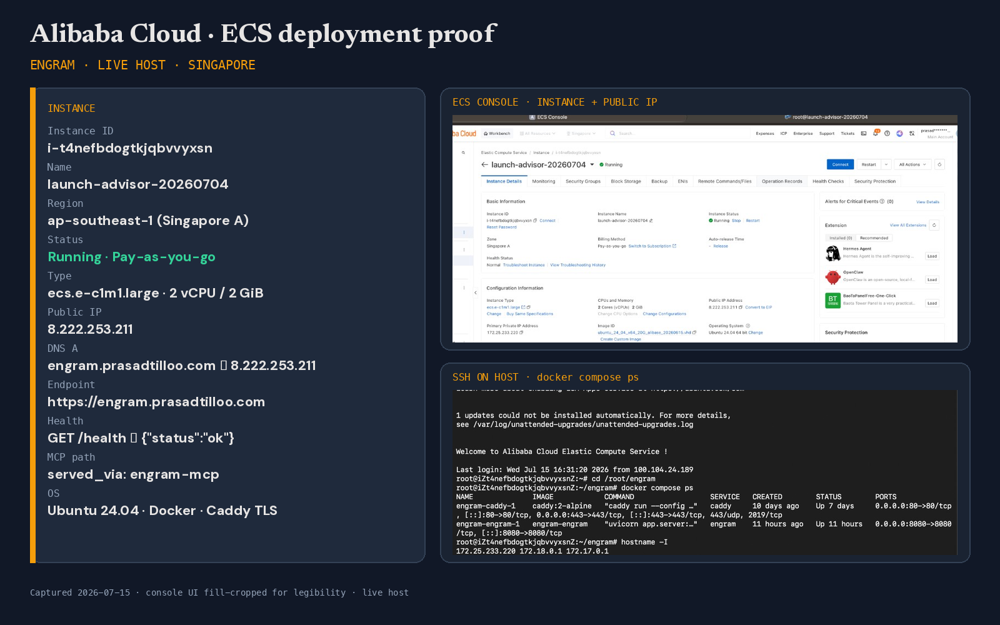

# Proof of Alibaba Cloud deployment

This document collects the evidence that Engram's backend runs on Alibaba Cloud, per the hackathon submission requirements.

## 1. Code files using Alibaba Cloud services and APIs

- **Alibaba OSS (object storage)** — [`app/storage.py`](../app/storage.py): the `OSSStorage` class uses the official `oss2` SDK against a private bucket in `ap-southeast-1`, with presigned read URLs (`sign_url`). Selected via `STORAGE_BACKEND=oss`.
- **Qwen Cloud / DashScope (managed model API)** — [`app/qwen_client.py`](../app/qwen_client.py): every model call in the product goes through Alibaba's OpenAI-compatible endpoint at `dashscope-intl.aliyuncs.com` (`qwen-vl-max`, `qwen3.7-max`, `qwen3.6-flash`; IDs in [`app/config.py`](../app/config.py)). No self-hosted weights anywhere.

## 2. Containerized deployment

The backend ships as a Docker image ([`Dockerfile`](../Dockerfile), [`docker-compose.yml`](../docker-compose.yml)) verified end-to-end in-container, including the `engram-mcp` subprocess path (`GET /api/v1/memory-stats?via=mcp` returns `"served_via": "engram-mcp"` from inside the image).

## 3. Live instance (ECS/SAS, Singapore)

Deployed **July 4, 2026** on a pay-as-you-go ECS instance.

- Instance: `i-t4nefbdogtkjqbvvyxsn` (Economy e, 2 vCPU / 2 GiB, Ubuntu 24.04)
- Region: **ap-southeast-1 (Singapore)** — co-located with the DashScope intl endpoint
- Public endpoint: **http://8.222.253.211:8080** — the full app (built SPA served same-origin) and API
  - Live app / judge mode: `http://8.222.253.211:8080/?judge=1`
  - Health: `http://8.222.253.211:8080/health`
  - Live MCP path: `http://8.222.253.211:8080/api/v1/memory-stats?via=mcp` → `"served_via": "engram-mcp"`
- Console screenshot:  *(slot — added with the captured screenshot)*
