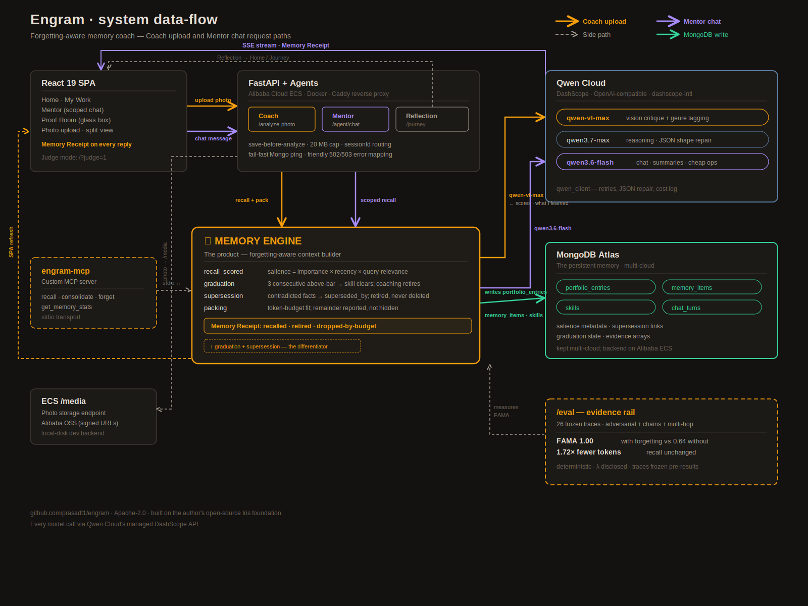

# Dual Architecture Diagrams Implementation Plan

> **For agentic workers:** REQUIRED SUB-SKILL: Use superpowers:subagent-driven-development (recommended) or superpowers:executing-plans to implement this plan task-by-task. Steps use checkbox (`- [ ]`) syntax for tracking.

**Goal:** Ship a readable cream/dark context diagram for Devpost + a zoomable GitHub data-flow SVG, with docs updated so judges can follow both.

**Architecture:** Context diagram is HTML/CSS in `tools/devpost-gallery/architecture.html` (Playwright cream/dark captures). Flow diagram is a hand-maintained SVG under `docs/architecture/` plus a thin HTML viewer. Gallery stops using the Python `architecture-visual.png` pipeline.

**Tech Stack:** HTML/CSS, SVG, Playwright (Chrome channel), existing Simple Icons / brand fills, Markdown docs.

**Spec:** `docs/architecture/2026-07-16-dual-architecture-diagrams-design.md`

**Model names (live stack — use these in the flow SVG, not stale 2.5 labels):**  
`qwen-vl-max` · `qwen3.7-max` · `qwen3.6-flash`  

*(Spec still mentions `qwen2.5-flash` in one place; plan intentionally uses live DashScope tiers from DEVPOST / `WHATS_NEW`.)*

---

## File map

| File | Responsibility |
|------|----------------|
| `tools/devpost-gallery/architecture.html` | Context diagram only: vertical hero layout, logos, `?mode=context&theme=cream\|dark` |
| `tools/devpost-gallery/capture-architecture.mjs` | Dark gallery PNGs via query theme |
| `tools/devpost-gallery/capture-architecture-light.mjs` | Cream PNGs → public + `docs/media/devpost-inline-architecture.png` |
| `tools/devpost-gallery/screens.json` | Gallery architecture slot → Playwright dark capture path |
| `docs/architecture/system-flow.svg` | Data-flow source of truth |
| `docs/architecture/system-flow.html` | Embeds SVG; simple zoom/pan |
| `docs/architecture/README.md` | Diagrams section + ADR index; supersede legacy SVGs |
| `docs/BLOG-POST.md` | Inline image + full-scale link |
| `docs/DEVPOST-DRAFT.md` | Same (gitignored; still edit) |
| `docs/devpost-gallery-upload.md` | Point at Playwright capture; mark Python builder superseded |

**Do not** regenerate `docs/architecture.svg` / `architecture-dark.svg` — only mark superseded in README.

---

### Task 1: Context diagram HTML — query theme + simplified layout

**Files:**
- Modify: `tools/devpost-gallery/architecture.html`

- [ ] **Step 1: Add theme + mode bootstrapping**

At end of `<body>` (or in `<head>` script), parse query params. If `theme=cream`, apply the cream CSS variable set currently injected by `capture-architecture-light.mjs` (move that LIGHT block into a `<style id="theme-cream">` disabled by default, enable when `theme=cream`). Swap brand mark to `engram-mark-light.png` when cream. Ignore unknown `mode` values other than `context` (default = context layout only — no flow mode in this file).

```js
const params = new URLSearchParams(location.search);
const theme = params.get('theme') === 'cream' ? 'cream' : 'dark';
document.documentElement.dataset.theme = theme;
if (theme === 'cream') {
  document.getElementById('theme-cream')?.removeAttribute('disabled');
  const mark = document.querySelector('.brand .mark, header img.mark, .mark');
  if (mark) mark.setAttribute('src', '../../frontend/public/engram-mark-light.png');
}
```

- [ ] **Step 2: Replace dense band body with context layout**

Keep header/footer branding. Replace `#diagram` contents with the locked vertical stack:

1. React SPA row (Home · Mentor · Proof Room) + React logo  
2. FastAPI + agents on Alibaba ECS (Coach · Mentor · Reflection · engram-mcp) + Python, Alibaba, Caddy, Docker, MCP logos  
3. **MEMORY ENGINE** hero (salience · graduation · supersession · packing) — gold accent, no logo clutter on this band  
4. Split row: Qwen Cloud | MongoDB Atlas + logos  

Big labels only. Drop left evidence rail fine print from the *context* view (or collapse to one short “Open source · ADRs” chip) so ~700px article shrinks stay readable. Drop model/collection dumps from context.

Reuse existing logo SVG/img patterns already in this file (or Simple Icons paths used elsewhere in gallery tooling). Logos: React, Python, Alibaba Cloud, Qwen, MongoDB, MCP, Caddy, Docker.

- [ ] **Step 3: Open in browser and eyeball**

Run: open `file://…/tools/devpost-gallery/architecture.html?mode=context&theme=dark` and `…&theme=cream` in Chrome.  
Expected: Memory Engine is the visual hero; cream mark is dark ink; all eight logos visible; no unreadable fine print.

- [ ] **Step 4: Commit**

```bash
git add tools/devpost-gallery/architecture.html
git commit -m "Simplify architecture.html into readable context diagram with cream/dark themes."
```

---

### Task 2: Wire Playwright captures to query themes + inline media path

**Files:**
- Modify: `tools/devpost-gallery/capture-architecture.mjs`
- Modify: `tools/devpost-gallery/capture-architecture-light.mjs`
- Create/update: `docs/media/devpost-inline-architecture.png` (via capture)
- Create/update: `docs/devpost-public/annotated-05-architecture.png`, `standalone-05-architecture.png`, `annotated-05-architecture-light.png`

- [ ] **Step 1: Update dark capture**

In `capture-architecture.mjs`, change goto to:

```js
const html = join(__dirname, 'architecture.html');
await page.goto('file://' + html + '?mode=context&theme=dark');
```

Remove any leftover assumptions that theme is default-only. Keep `#diagram` standalone screenshot.

- [ ] **Step 2: Update cream capture**

In `capture-architecture-light.mjs`:

- Goto `architecture.html?mode=context&theme=cream`
- **Remove** the injected `LIGHT` style tag and mark swap (HTML owns theme now)
- Write both outputs:

```js
import { copyFileSync, mkdirSync } from 'node:fs';
const MEDIA = join(ROOT, 'docs/media');
mkdirSync(OUT, { recursive: true });
mkdirSync(MEDIA, { recursive: true });
const lightPath = join(OUT, 'annotated-05-architecture-light.png');
await page.screenshot({ path: lightPath });
copyFileSync(lightPath, join(MEDIA, 'devpost-inline-architecture.png'));
```

- [ ] **Step 3: Run captures**

```bash
cd tools/devpost-gallery
node capture-architecture.mjs
node capture-architecture-light.mjs
```

Expected: console logs write paths; PNGs exist; cream inline is readable when viewed at ~700px width.

- [ ] **Step 4: Commit**

```bash
git add tools/devpost-gallery/capture-architecture.mjs \
        tools/devpost-gallery/capture-architecture-light.mjs \
        docs/media/devpost-inline-architecture.png \
        docs/devpost-public/annotated-05-architecture.png \
        docs/devpost-public/standalone-05-architecture.png \
        docs/devpost-public/annotated-05-architecture-light.png
git commit -m "Capture cream/dark context architecture PNGs via query themes."
```

Also update Task 2 dark capture (Step 1) to write `docs/media/devpost-gallery-architecture.png` as above so Task 3 only changes `screens.json`.

---

### Task 3: Point gallery at Playwright dark capture; supersede Python builder

**Files:**
- Modify: `tools/devpost-gallery/screens.json` (architecture screen ~id `05`)
- Modify: `docs/devpost-gallery-upload.md`
- Optionally annotate: `scripts/build-architecture-diagram.py` header comment “superseded for Devpost gallery”

- [ ] **Step 1: Retarget screens.json to a committed media path**

`docs/devpost-public/` is gitignored — do **not** point `architecturePng` there.

1. In `capture-architecture.mjs`, after writing public PNGs, also write:

```js
import { copyFileSync, mkdirSync } from 'node:fs';
const MEDIA = join(ROOT, 'docs/media');
mkdirSync(MEDIA, { recursive: true });
copyFileSync(
  join(OUT, 'standalone-05-architecture.png'),
  join(MEDIA, 'devpost-gallery-architecture.png'),
);
```

2. In `screens.json` architecture screen:

```json
"architecturePng": "docs/media/devpost-gallery-architecture.png"
```

That file is committed so `capture.mjs` works on a fresh clone.

- [ ] **Step 2: Update upload doc**

In `docs/devpost-gallery-upload.md`, replace “run `build-architecture-diagram.py`” with:

```bash
node tools/devpost-gallery/capture-architecture.mjs
node tools/devpost-gallery/capture-architecture-light.mjs
```

Note Python builder superseded for gallery.

- [ ] **Step 3: Commit**

```bash
git add tools/devpost-gallery/screens.json docs/devpost-gallery-upload.md scripts/build-architecture-diagram.py docs/media/
git commit -m "Point gallery architecture slot at Playwright context capture."
```

---

### Task 4: Hand-author `system-flow.svg`

**Files:**
- Create: `docs/architecture/system-flow.svg`

- [ ] **Step 1: Draw SVG with labeled request paths**

ViewBox ~1600×1200 (or similar). Brand colors match architecture.html (canvas `#141210`, amber `#f59e0b`, text `#e8e0d6`).

**Boxes:** SPA · FastAPI/agents · Memory Engine (hero) · Qwen Cloud · MongoDB Atlas · ECS `/media` · MCP · dashed Evidence/eval rail.

**Solid arrows — Coach upload:**  
SPA → FastAPI → Memory Engine (recall+pack) → `qwen-vl-max` → scores / what I learned → writes `portfolio_entries` · `memory_items` · `skills` → SPA refresh.

**Solid arrows — Mentor chat:**  
SPA → FastAPI → Memory Engine (scoped recall) → `qwen3.6-flash` → SSE → Memory Receipt.

**Dashed:** Reflection → Home · MCP stdio · `/eval` FAMA · photo → `/media`.

Include graduation / supersession callouts on Memory Engine. Use live model names above (not `qwen2.5-*`).

- [ ] **Step 2: Open SVG in browser / Preview**

Expected: arrows readable when zoomed; Coach vs Mentor paths distinguishable (e.g. amber vs violet stroke).

- [ ] **Step 3: Commit**

```bash
git add docs/architecture/system-flow.svg
git commit -m "Add system-flow SVG with Coach and Mentor request paths."
```

---

### Task 5: HTML viewer for the flow SVG

**Files:**
- Create: `docs/architecture/system-flow.html`

- [ ] **Step 1: Write thin viewer**

```html
<!DOCTYPE html>
<html lang="en">
<head>
  <meta charset="utf-8" />
  <title>Engram — system data flow</title>
  <style>
    body { margin: 0; background: #141210; color: #e8e0d6; font-family: system-ui, sans-serif; }
    header { padding: 12px 20px; border-bottom: 1px solid rgba(196,184,168,0.2); }
    header a { color: #f59e0b; }
    .stage { overflow: auto; height: calc(100vh - 52px); }
    .stage img, .stage object { display: block; min-width: 100%; }
    /* Prefer native browser zoom; optional: transform scale via buttons */
  </style>
</head>
<body>
  <header>
    Engram system data-flow ·
    <a href="system-flow.svg">Raw SVG</a> ·
    <a href="README.md">Architecture docs</a>
  </header>
  <div class="stage">
    
  </div>
</body>
</html>
```

- [ ] **Step 2: Open `system-flow.html` via file:// or a static server**

Expected: diagram visible; raw SVG link works.

- [ ] **Step 3: Commit**

```bash
git add docs/architecture/system-flow.html
git commit -m "Add HTML viewer for system-flow SVG."
```

---

### Task 6: Docs — README, blog, Devpost draft

**Files:**
- Modify: `docs/architecture/README.md`
- Modify: `docs/BLOG-POST.md`
- Modify: `docs/DEVPOST-DRAFT.md` (gitignored — still edit; won’t appear in commit unless force-added; do not force-add secrets)

- [ ] **Step 1: README diagrams section**

Insert **above** the ADR index:

```markdown
## System diagrams

| View | Link |
|------|------|
| Context (article / gallery) | Cream inline: [`../media/devpost-inline-architecture.png`](../media/devpost-inline-architecture.png) |
| Full data-flow (zoomable) | [`system-flow.html`](system-flow.html) · raw [`system-flow.svg`](system-flow.svg) |

Legacy posters [`../architecture.svg`](../architecture.svg) and [`../architecture-dark.svg`](../architecture-dark.svg) are **superseded** by the context PNG + `system-flow.svg`.
```

Update the old “See also architecture.svg” line accordingly.

- [ ] **Step 2: BLOG-POST + DEVPOST-DRAFT**

Under the architecture image, ensure cream URL still points at:

`https://raw.githubusercontent.com/prasadt1/engram/main/docs/media/devpost-inline-architecture.png`

Add immediately below:

```markdown
[Full-scale data-flow diagram →](https://github.com/prasadt1/engram/tree/main/docs/architecture)
```

Keep existing one-line caption about Docker / ECS / DashScope if present.

- [ ] **Step 3: Commit trackable docs**

```bash
git add docs/architecture/README.md docs/BLOG-POST.md
git commit -m "Link context and data-flow diagrams from architecture README and blog."
```

Manually paste the same link line into the live Devpost editor from `DEVPOST-DRAFT.md` (local edit).

---

### Task 7: Final verification

- [ ] **Step 1: Re-run both captures** (after any last HTML tweaks)

- [ ] **Step 2: Checklist against spec success criteria**

1. Cream PNG readable at ~700px (open Preview, shrink window).  
2. `docs/architecture/` has SVG + HTML with Coach + Mentor paths and live model names.  
3. Dark gallery capture looks on-brand.  
4. Logos present; Memory Engine band not logo-cluttered.  
5. README marks legacy SVGs superseded.  
6. Blog has full-scale link; DEVPOST-DRAFT locally matches.

- [ ] **Step 3: Push when user asks** (do not push unless requested)

---

## Execution notes

- Prefer Chrome channel Playwright (`channel: 'chrome'`) — matches existing scripts.  
- If fonts 404 from `file://`, scripts already wait on `document.fonts`; ensure `frontend/node_modules/@fontsource/...` exists locally before capture.  
- Do not edit ADR decision bodies.  
- Do not invent `mode=flow` inside `architecture.html`.
